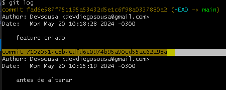
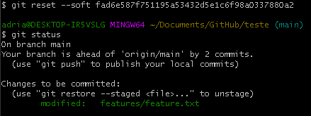

# Desfazendo alterações no repositório local

Você já sabe como criar alterações e salvá-las, nada mais útil do que aprender a desfazer essas alterações.

## 🎮 Comandos

` rm -rf (pasta/arquivo)` - Remove a força a pasta ou arquivo

`$ git restore (arquivo)` - Restaura o arquivo para a versão dele do último commit

`$ git commit --amend -m"nome do commit"` - Altera o nome do último commit

`$ git reset <hash do commit>` - Retorna para o commit apontado pelo hash

`$ git reflog` - Demonstra o historico de commits com todas as alterações feitas

## 🖥 Desfazendo alterações

Você está evoluindo, e sabe como fazer alterações no seu repositório local bem como salva-las, entretanto por muitas vezes é essencial saber como desfazer essas alterações.

### Exemplo

### Desfazendo o git init
Seu primeiro erro foi ter iniciado o repositório local em uma pasta errada. Sua missão agora é abrir o GIT na pasta, e usar o comando abaixo para excluir o .git e desfazer esse erro.

`rm -rf .git`

#### Alterando o nome do commit
Agora que você iniciou seu GIT na pasta correta, você percebeu que criou o primeiro commit com um nome aleatorio sem querer, e deseja troca-lo para "initial". Para corrigir o nome, use o comando abaixo antes de iniciar um novo commit.

`$ git commit --amend -m"initial"`

### Desfazendo alterações em arquivos
Você percebeu que após alterar um arquivo chamado feature.txt na pasta features, você irá precisar da sua versão sem as alterações, e sabendo que essa versão estava no commit anterior, você usará o comando a seguir:

`$ git restore features/feature.txt`

### Voltando para um commit anterior

Por diversos motivos você precisa voltar para um commit anterior, e para retornar para o commit desejado, você precisará saber seu hash, que você pode encontrar utilizando o comando `$ git log`



Agora que você já tem o hash do commit desejado, você tem três opções de comandos para utilizar, sendo que cada um tem sua finalidade.
```
$ git reset <hash do commit>
$ git reset --soft <hash do commit>
$ git reset --hard <hash do commit>
```
O reset padrão faz com que todos os arquivos/pastas criados após o commit de retorno sejam esquecidos, podendo eles serem adicionados a área de preparação ou excluidos.

Ao utilizar o comando `$ git reset --soft`, seus arquivos posteriores ao commit de retorno seram adicionados a área de prepração automaticamente.

Utilizando o `$ git reset --hard`, seus arquivos posteriores ao commit de retorno serão excluidos. Tenha **cuidado** ao usar esse reset.

### Modificando a área de preparação
Você optou por usar o `$ git reset --soft` e seu arquivo feature.txt foi diretamente para a área de preparação do commit a qual você retornou.



Entretanto você percebeu que necessita retirar esse arquivo da área de preparação, logo você pode usar qualquer um dos dois códigos abaixo:

```
$ git reset features/feature.txt
$ git restore --staged features/feature.txt

```

## 📖 Outras informações

- `git reset <hash do commit>` é o mesmo que utilizar o comando `git reset --mixed <hash do commit>`
