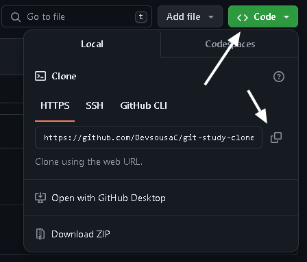

# Integração com o repositório remoto

Uma excelente vantagem do uso do GIT juntamente com o GITHUB é conseguir acessar e editar seu repositório de qualquer lugar, e para isso é necessario que você conecte seu repositório local criado com o GIT com um repositório remoto usando o GITHUB.

## 🎮 Comandos

`$ git remote add <remoto> (url repositório remoto)` - Conecta o repositório local com o repositório remoto

`$ git branch -M <nome>` - Renomeia a branch "master" para o nome desejado

`$ git push -u <remoto> <branch>` - Responsavel por enviar o conteudo do nosso repositório local para o repositório remoto

`$ git pull <remoto> <branch>` - Busca todas as alterações do repositório remoto e mescla com o conteudo do repositório local

`$ git pull <remoto> <branch> --allow-unrelated-histories` - Usado para quando o log de commits do repositório remoto não bate com o local
## 🖥 Conectando seu repositório

Agora que o seu repositório local já está criado, e você já sabe como altera-lo localmente, está na hora de entender como configura-lo para se conectar ao GITHUB.

### Exemplo

#### Conectando os repositórios

Você deseja conectar seu repositório local com seu repositório remoto no GITHUB chamado de "origin", para isso você deverá encontrar o link do seu repositório remoto na seção "Code" do seu repositório GITHUB

Agora que você já possui o link e o nome do seu repositório remoto, basta utilizar o comando abaixo para que seu repositório local saiba onde se conectar.

`$ git remote add origin (url repositório remoto)`

#### Renomeando a Branch master

Sua Branch principal ainda não foi renomeada, e para dar o nome "main" a ela você usará o seguinte comando:

`$ git branch -M main`

#### Do repositório local para o remoto
Agora para que você possa enviar os arquivos do seu repositório local para o remoto na branch main você deverá utilizar o seguinte código

`$ git push -u origin main`

#### Do repositório remoto para o local

Sempre que você desejar puxar e mesclar os arquivos do repositório remoto para o seu repositório local basta utilizar o seguinte comando:

`$ git pull`

## 📖 Outras informaçoes

A nomeação da branch principal para "main" é opcional, mas altamente recomendada, uma vez que está é uma prática utilizada pela grande maioria da comunidade, facilitando o entendimento do seu repositório