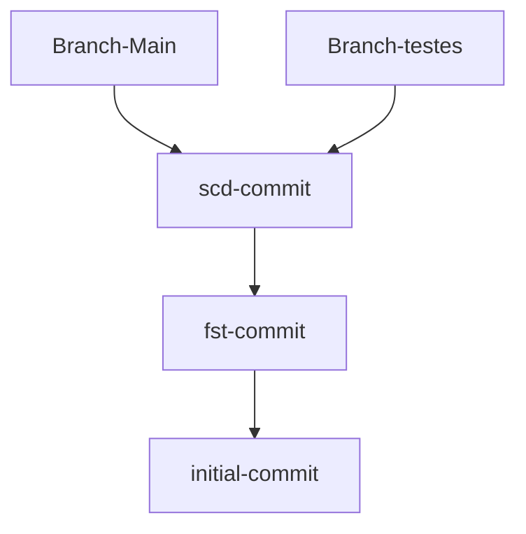
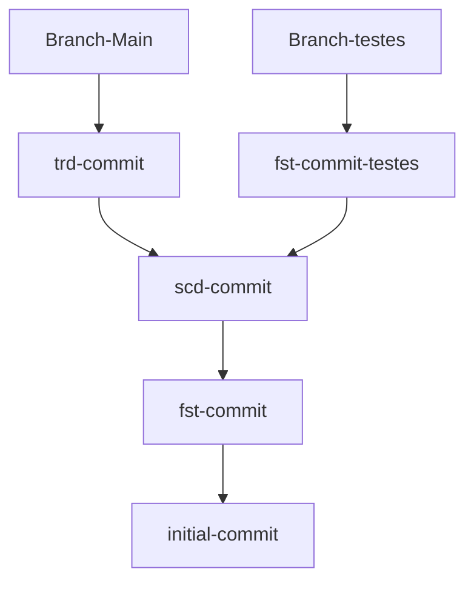
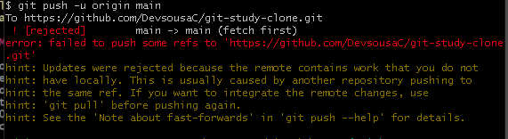
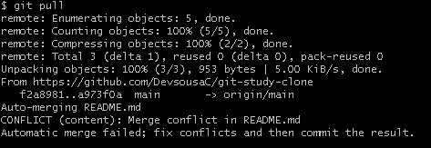
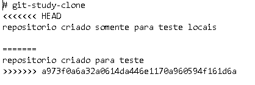
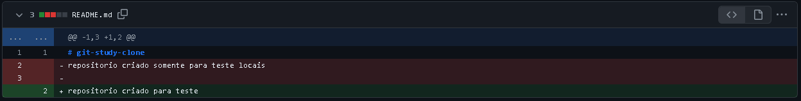

# Trabalhando com Branches

Branches são muito importantes para que você possa criar alterações ou desenvolver *features* no seu repositório sem afetar diretamente seu código principal.
## Conceito

Para que você possa entender melhor o que é uma Branch e por que é tão importante aprender a usar essa ferramenta, imagine que todo o seu repositório é um multiverso, e cada Branch é um universo, sendo assim, quando você cria uma alteração em uma Branch (universo), todas as outras permanecem inalteradas.

Isso é muito importante para que você possa desenvolver novas **features** sem arriscar a usabilidade do seu código principal .

## 🎮 Comandos

`$ git branch` - Lista as Branches que o repositório possui.

`$ git branch -v` - Lista o último commit de cada Branch.

`$ git checkout <nomedabranch>` - Muda de Branch.

`$ git checkout -b <nomedabranch>` - Cria uma nova Branch.

`$ git branch -d <nomedabranch>` - exclui a Branch apontada.

`$ git merge <nomedabranch>` - Mescla o conteudo da Branch apontada com a sua branch atual.

## 🖥 Usando as Branches

### Criando uma Branch
Para criar uma Branch nova use o comando

`$ git checkout -b <nomedabranch>`

Quando uma nova Branch é criada ela **sempre** irá apontar inicialmente para o commit que a Branch anterior apontava, recebendo todos os arquivos dela.

#### Exemplo

Caso você possua uma branch main e crie uma para testes, o resultado será o exibido abaixo.

Entretanto ao iniciar um novo commit através dessa Branch apenas a Branch testes irá apontar para ela, e caso um novo commit seja criado pela branch main, ele em nada afetará a Branch testes

### Excluindo uma Branch
A exclusão de uma Branch é infinitamente mais fácil de entender do que sua criação, para isto basta digitar o comando a seguir que automaticamente ela irá ser excluída.

`$ git branch -d <nomedabranch>`

Você deve tomar **cuidado** ao decidir excluir uma Branch, uma vez que todos os commits originados a partir dela serão também deletados.

### Mesclando Branches

A mesclagem de Branches é feita quando há a necessidade de juntar as modificações realizadas em ambas as Branches, como quando uma *feature* criada num ambiente de testes está pronta para ir para o código principal.

Para isso você pode listar as Branches usando:

`$ git branch`

e usar o comando:

`$ git merge <nomedabranch>`

Dessa maneira, a Branch apontada será mesclada na sua Branch atual.

### Conflitos de merge
Um conflito de merge acontece quando dois ou mais indivíduos editam a mesma linha, ou um mesmo arquivo na totalidade, resultando em um conflito no qual o GIT não consegue entender, qual alteração deverá ser mantida.

#### Exemplo

Imagine que enquanto você trabalhava em um arquivo da branch main, outro membro da sua equipe não só fez modificações na Branch como enviou o commit para o repositório remoto. 

Naturalmente, quando você for adicionar suas modificações ao repositório remoto, este erro irá aparecer para você

Corrigir o erro é bem simples, basta baixar as informações no seu repositório local usando o comando:

`$ git pull`

Entretanto, outro problema irá surgir chamado “conflito de *merge*”

Para resolver esse conflito, você deverá apontar para o GIT qual versão manter manualmente. Você pode editar o arquivo em um bloco de notas ou usar uma **IDE** como o VS CODE que te permite automatizar uma parte desse processo.

Entretanto, devo te alertar sobre o cuidado ao resolver conflitos de merge de modo a garantir que todas as funcionalidades implementadas estejam funcionando.

Assim que você resolver esse conflito e enviar um novo commit para o repositório remoto, o GITHUB exibirá todas as modificações realizadas.

